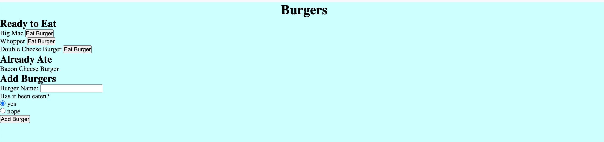

# Burger - Logger

Burger-Logger is a restaurant app that lets users input the names of burgers they'd like to eat.

# How it Works

Once user inputs a burger name, user has option to choose yes or no if the burger has been eaten. If "no" is selected then the burger will go into the "Ready to Eat" section of the page. Then user has an option to click if the burger has been eaten.

.
